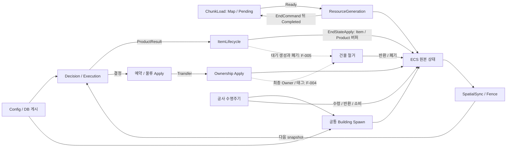

# Q30b 평가 결과 — 시스템 간 의존성 종합 평가

[평가 계획](../V2%20Quality%20Evaluation%20Plan.md) · [Q00 기준선](Q00.md) · 공통 판단 기준 [Q01b](Q01b.md). 완료된 Q02~Q30a의 **Reader/Writer·의존 관계·변경 영향과 직접 관련 문제 절**을 종합했다. 과거 CodeMemory 전체나 이전 V1 구현을 새로 감사하지 않았다.

### Q30b — 시스템 간 의존성 종합 평가

- 평가일 / 평가 상태: **2026-09-29 (Asia/Seoul) / 평가 완료 — 코드·누적 근거 종합**.
- 기준: HEAD **`d3c100f1bd04e8026f8c1181411eb418cc6f1b33`**, Q00와 동일. Unity 프로젝트 지정 버전 **6000.4.11f1** 및 패키지 기준은 Q00 참조.
- 기준선 이후 관련 변경: 시작 시 `git diff <Q00 HEAD> --stat -- Assets/Scripts Assets/Editor/Tests ProjectSettings/ProjectVersion.txt Packages/manifest.json Packages/packages-lock.json` 출력 없음. 기존 `D PROJECT_EVALUATION_PLAN.md`와 미추적 평가 폴더를 보존했다. 명령별 safe.directory만 사용했고 Git 설정은 변경하지 않았다.
- 범위: 공개 데이터·Phase/Job/Fence/ECB, 직접 호출/수명 제어, 상태 교차 쓰기, 숨은 순서, 왕복과 순환 제어의 구분, 책임 집중, 계약 유지 변경 영향, 분리 후보. 핵심 현재 소스 근거는 §1. 미평가/미확인 범위는 §7.
- 흐름: 설정/베이킹 게시 → 명령·결정·예약·실행·상태 반영 → 두 ECB와 공간 Sync → 다음 판단. 단순 선형 흐름 외에 청크 완료 통지, 재고/백프레셔, 레시피 변경·잔여물 배출의 공개 피드백이 있다.
- 안정성 판단 / 근거: **일부 불일치**. 정상 인계·명시적 동기화는 존재하지만 F-004/F-005의 최종 소유/대기 생성, F-024의 실패 반환 무시, F-029의 중재 범위 등 교차 경계 문제가 남는다. 각 최초 문서의 근거 수준·우선순위를 유지한다.
- 유지보수성 판단 / 근거: **일부 불일치**. Registry·Chunk Ready/Completed·결정/결과 인계는 내부 계산 변경을 국소화한다. 반면 입력 유일성, footprint 표현, Item 초기화 복제, 제작 상태의 일반 입고 노출, 초기화 수명/테스트 준비가 변경 영향 범위를 넓힌다.
- V2 적합성 판단 / 적용 원칙 / 근거: **일부 불일치**. 데이터 계약을 통한 협력과 원본/파생 인덱스 분리는 확인된다. 그러나 Phase로 분리했다는 사실만으로 상태 Owner·실패/폐기 계약이 정리된 것은 아니다. **V1 대비 의존성 감소는 비교 근거가 없어 확정하지 않는다.**
- 시스템 간 의존 관계 / 필요한 계약과 개선할 결합 / 변경 영향: §2~§5. 의존성 수·UpdateAfter 수·통합 시스템 수로 점수화하지 않았다.
- 테스트 선택 이유와 질문: 누적된 의존 경계를 분류하고 현재 분기/Writer/가시성으로 결론을 확인하는 단계다. 새 동작 실행이 꼭 필요한 질문을 추가하지 않아 기존 근거를 재사용했다.
- 실행 근거 / 통계: **이번 새 컴파일·EditMode·Play Mode 실행 없음**. 새 실행 시각·필터·결과 파일·Passed/Failed/Skipped/Inconclusive는 해당 없음. 이전 Q30a의 선택 **4/4 통과, 실패/생략/미결정 0**은 §6에서 출처와 한계를 연결하며 신규 실적으로 합산하지 않는다.
- 미실행 또는 차단 사유: 코드/문서 종합만 수행. 필요한 실행이 실패·연결 문제·승인 거부로 막힌 상태가 아니다. 미검증 반례는 기존 보강 제안으로 남긴다.
- 발견 문제 ID: **신규 없음**. 기존 F-001~F-048의 직접 관련 문제를 최초 문서로 연결했다. 결합 개선 후보를 새 구현 결함으로 자동 등록하지 않는다.
- 미확인 / 사용자 수동 확인 / 설계 질문: 전체 가능한 실행 순서, 실제 Bake/World/Player·성능·외부 예약 수명 등은 §7. 사용자 수동 확인 자료 없음. 별도 결정은 §8.
- 완료 조건 / 다음 단계: 누적 관계·Writer·직접 제어/순환/책임·계약 유지 변경 영향·분리 후보·기존 실행/미확인 범위 기록 완료. **Q30b만 완료**. 다음 후보 Q31이나 수정 작업은 진행하지 않는다.

## 1. 사용한 누적 근거와 현재 소스 확인

계획의 기준과 `Architecture V2 Plan_0.2.md:11–18,60–68,1011–1035`를 대조했다. 중요한 상태의 명확한 Owner, 공개 계약 우선, 원본/파생 데이터 분리, 의존성 0이 아닌 **내부 구현 지식과 변경 전파의 축소**를 적용했다. 미구현 전력/드론 등의 설계 예시를 현재 시스템 존재로 해석하지 않았다.

| 누적 영역 / 읽거나 앞선 동일 소스 분석에서 재사용한 절 | 이번 종합에 사용한 내용 |
| --- | --- |
| [Q01a](Q01a.md) §4~5, [Q01b](Q01b.md) §3~4 | 여섯 Phase, 두 ECB, producer handle, Map/Fence, World 등록/정렬의 구분 |
| [Q02](Q02.md) §3/5·F-003/F-004, [Q03](Q03.md) §3~4·F-005/F-006 | 소유 버퍼와 Owner/표시, 생성·삭제·철거 인계 |
| [Q04](Q04.md) §4, [Q05](Q05.md) §4, [Q06](Q06.md) §4, [Q07](Q07.md) §3~4 | 설정 게시·읽기·Blob 수명·입력/준비 의미 |
| [Q08](Q08.md) §4, [Q09](Q09.md) §4, [Q10](Q10.md) §4, [Q11](Q11.md) §4 | Baker/DB·정적/런타임 구성·공통 Spawn·실제 자산 연결 한계 |
| [Q12](Q12.md) §4/6·F-026/F-028, [Q13](Q13.md) §4, [Q14](Q14.md) §4, [Q15](Q15.md) §4, [Q16](Q16.md) §4 | Map Owner와 Reader·입출고/이동/라우팅 승인·필요/누락/추가 동기화 |
| [Q17](Q17.md) §4, [Q18](Q18.md) §5, [Q19](Q19.md) §5, [Q20](Q20.md) §5 | 청크 왕복·결정론·순수 바닥 선택·채굴 결과 |
| [Q21](Q21.md) §3~4, [Q22](Q22.md) §4 | 제작 상태·선소비·잔여물·일반 입고와의 협력 |
| [Q23](Q23.md) §5, [Q24](Q24.md) §5, [Q25](Q25.md) §5, [Q26](Q26.md) §5, [Q27](Q27.md) §4, [Q28](Q28.md) §4 | 배치/자재/취소/완료/직접 Spawn/철거 및 내부 가시성 |
| [Q29](Q29.md) §2~5, [Q30a](Q30a.md) §2~6 | Factory·Validator·수동/그룹 실행의 한계, 최종 연결부와 실행 근거 |

아래 경로는 프로젝트 루트 기준이다. 이번에 다시 확인한 핵심 심볼·분기이며, Q29/Q30a에서 이미 본 동일 파일의 대형 본문은 기준선 diff가 없음을 확인하고 재사용했다.

| 현재 소스 확인 | 확인 결과와 사용 범위 |
| --- | --- |
| `Assets/Scripts/Systems/`, `Assets/Scripts/Phases/`의 `.Update(`, `.OnUpdate(`, `.Playback(`, `GetOrCreateSystem`, `GetExistingSystem`, `Enabled =` 검색 | lookup.Update(ref state)를 제외하면 다른 gameplay 시스템 Update 제어는 발견하지 못함. 시스템 취득은 두 ECB용이며 Enabled=false는 자기 초기화 시스템 종료. RecipeCommand에는 임시 ECB의 직접 Playback fallback이 있음 |
| `Systems/1_Command/ChunkLoadCommandSystem.cs:20–30,51–98`, `ResourceGenerationCommandSystem.cs:29–32,56,85–101` | Load만 Map/Pending 확정·중복 제거. Generation은 Ready 소비와 스폰+Completed ECB만 기록. 공개 왕복 근거 |
| `Systems/0_Initialization/ItemConfigInitSystem.cs:32–92` | 정상 Init 필드의 Blob 소유/Dispose와 static 초기화의 별도 반환·기존 singleton 교체 경로. F-008의 수명 경계 |
| `Config/BuildingConfigLoader.cs:163–181`, `Config/RecipeConfigLoader.cs:88–95` | 중복 품목 행을 합산/유일성 확인 없이 게시. Material `:300–308` 첫 일치, CrafterDecision `:244–264` 행별 같은 재고 계수, CrafterExecution `:118–135` 순차 선소비와 대조 |
| `Systems/1_Command/BuildingPlacementCommandSystem.cs:28–46`, `CrafterRecipeCommandSystem.cs:42–95` | Map/Lookup 직접 조회 경계에서 명시적인 관련 완료 코드 없음. F-026/F-039의 조건부 위험 유지. 요청 생성 등의 실제 선행 완료 효과까지 실행 재현한 것은 아님 |
| `Systems/2_Decision/MinerDecisionSystem.cs:55,72–75`, `BuildingItemInputDecisionSystem.cs:58–84` | Fence Reader dependency 결합·등록과 RW metadata 취득. 필요한 Map 동기화와 F-028의 추가 ECS 의존 구분 |
| `Components/Buildings/BuildingComponents.cs:64–92`, `Common/BuildingLifecycleUtility.cs:59–60,89,102`, Placement `:136–137` | Size의 기본 크기 의미/회전 함수에 대해 Writer는 effective를 저장. Q30a에서 확인한 BuildingSpatialSync `:141–163`의 재회전과 연결 |
| `Systems/2_Decision/BuildingItemInputDecisionSystem.cs:118–132,150–175` | world/progress 검사, Storage 요구, Crafter의 구체 WaitingForByproductOutput enum 차단. movement enable 구분 누락과 상태 정책 결합은 서로 구분 |
| `Common/BuildingLifecycleUtility.cs:138–147`, `Systems/5_StateApply/BuildingLifecycleApplySystem.cs:107–150,387–420` | Crafter 생성 구성, Spawn-only에도 준비되는 Item DB 조회, 별도 환급 Item 초기화. F-037/F-018/F-020 |
| Q30a에서 직접 읽은 `Systems/5_StateApply/ItemOwnershipApplySystem.cs:68–100`, `BuildingItemStorageApplySystem.cs:194–280`, `BuildingLifecycleApplySystem.cs:286–322,379–384`, `ConstructionLifecycleApplySystem.cs:88–168,193–242,324–359,393–458`, `ItemLifecycleApplySystem.cs:221–231` | 현재 HEAD·관련 diff 동일. Owner 직접 쓰기/태그 ECB, 버퍼 제거·Transfer, 대기 Append, Cancel→Material→Completion, 실패 Spawn 결과 미사용을 이번 핵심 결론에 재사용 |

검색 결과는 이 runtime 소스 범위의 근거다. 외부 패키지·반사 호출·모든 Editor 콜백을 포함한 완전한 호출 그래프를 자동 생성한 것은 아니다. Q12의 source-generator/ECS 의존 해석은 해당 단계의 로컬 패키지 소스 근거를 재사용했고 패키지 버전 변경은 없다.

## 2. 공개 계약을 중심으로 본 관계 개요

다음은 누적 관계의 일부를 압축한 그림이다. 실선은 공개 데이터 인계, 점선은 남은 조정 문제다. 모든 노드가 하나의 시스템이거나 별도 Phase라는 뜻은 아니다.

**공개 왕복은 순환 제어가 아니다.** ChunkLoad→Generation→Completed→ChunkLoad는 완료 후 Pending을 해제하는 수명 프로토콜이다. Generation이 Load.Update를 호출하거나 Map/Pending을 직접 고치지 않는다. 또한 생산→출고→버퍼 여유→다음 생산, 잔여물 배출→다음 판단의 입고/제작 재개는 상태 피드백이다. 이들을 제거해야 할 A↔B 호출 순환으로 분류하지 않는다.

## 3. 누적 관계표와 상태별 책임

### 3.1 관계 분류

| 관계 / 근거 | 형태·공개 계약 | 필요한 이유 | 판정과 변경 전파 |
| --- | --- | --- | --- |
| Init→Loader→Registry/설정 / Q04~Q07 | 직접 함수 호출·게시·할당 수명 | IO/파싱 뒤 불변 입력 제공 | **필요**. JSON 파서 내부 변경은 같은 데이터·실패·수명 계약이면 소비자에 전파되지 않음 |
| Baker/DB→Spawn/Generation / Q08~Q11 | 정적 매핑·필수 prefab 구성·준비 | 생성에 필요한 식별/transform/설정 | **필요**. 유일성/적합성 미검증 F-018/F-019, 실제 Bake 검증 공백 F-021은 별도 |
| Bootstrap→Queue→Load↔Generation / Q17~Q18 | 요청·Ready/Completed·EndCommand | 중복 제거·준비 대기·실체 생성 뒤 완료 | **적합한 왕복**. Tracker 내부와 광맥 계산을 서로 알 필요 없음 |
| Config/좌표→FloorSampler→Preview / Q19 | 순수 계산·표시 수명 | 같은 seed/셀의 선택 | **적합한 분리**. 청크 완료·Resource Map에 의존하지 않음. 실제 바닥 렌더 시스템까지 평가한 것은 아님 |
| SpatialSync/Fence↔Reader / Q12 | 원본→파생 Map, Writer/Reader 핸들 | NativeContainer 수명·완료 | **필요**. F-026/F-039는 접근 경계의 완료 누락 위험, F-028은 metadata로 인한 추가 의존이며 서로 다른 문제 |
| Decision→Reservation→Apply / Q13~Q16 | 프레임 결정·승인·소비 | 경합과 상태 반영 분리 | **필요**. F-029는 일반 이동 후보가 공통 중재 밖인 범위 문제. 승인 후 membership 전제는 F-033 |
| 물류 Apply→OwnershipApply / Q02/Q14~Q15 | 버퍼/이동 쓰기 후 Transfer·동일 tick | 소유/표시 인계 | **필요**. 일반 흐름은 공개 요청이나 철거와 겹치면 F-004의 세부 ECB 순서 지식이 필요 |
| Miner/Crafter→ProductResult→ItemLifecycle / Q03/Q20~Q21 | 품목·수량·슬롯 결과와 EndStateApply 실체화 | 생성 구현 분리 | **필요**. 생산 실패 결과 처리 F-006, 소유 건물 폐기 F-005의 계약 보강 필요 |
| RecipeCommand→Crafter/버퍼/Filter / Q22 | Command의 작업 취소·잔여물 인계 | 같은 작업의 여러 상태 일관성 | **필요한 조정**. 모든 다중 필드 쓰기를 위반으로 보지 않음. 무효 ID/선소비 취소 의미와 완료 경계는 F-039/F-040 |
| 일반 Input→Crafter.Status / Q14/Q21/Q22 | 특정 대기 enum 검사 | 잔여물 배출 중 신규 입고 차단 | **결합 개선 후보**. 정책 차단은 필요하나 제작 상태 분해가 일반 물류로 전파됨. 공개 입고 가능 계약을 둘지는 별도 선택 |
| Placement→site/요구→Material/Completion / Q23~Q25 | 생성 스키마·품목별 요구·flags | 검증한 현장의 동일 영역·실물·완료 | **필요**. F-010/F-023/F-027/F-041/F-042는 유일성·표현·선점/순서·필수 구성의 불일치 |
| Cancel→Material→Completion / Q24~Q26 | 내부 Job 핸들·Cancelled/Stored 즉시 가시성 | Cancel Wins, 마지막 자재 후 완료 | **필요한 정책 동기화**. 단일 시스템 통합 자체가 품질 근거는 아니며 F-003/F-024 등은 여전히 남음 |
| 두 건물 생성 caller→BuildingLifecycleUtility / Q09/Q25/Q27 | 공통 초기화/실패 반환·caller ECB | 타입별 생성 규칙 일치 | **적합한 책임 공유**. F-024는 공개 Null 실패 결과를 무시하는 caller 문제, F-037은 소비자 스키마와 불일치 |
| 철거→Item 반환/환급 생성 / Q08/Q28 | 실제 item 상태 직접 쓰기·별도 초기화 | 내용물 반환·비용 환급 | 반환 협력은 필요. F-020의 세부 Item 생성 규칙 복제, F-004/F-005 조정은 개선 대상 |
| 테스트/Validator→공개 상태·실행 경계 / Q29/Q30a | Factory·수동 또는 부분 그룹·검사/진단 | 국소/통합 관찰 | 유효하나 생성/Bake·모든 interleaving 보증 아님. F-021/F-037/F-044~F-048의 공백 유지 |

### 3.2 상태 교차 쓰기와 Owner의 실제 의미

| 상태 | 실제 Writer / Reader | 종합 판단 |
| --- | --- | --- |
| ItemOwnership / DisableRendering | 초기 생성, 일반 OwnershipApply, Material/Cancel, 철거 → 물류·Sync·렌더/검증 | ‘OwnershipApply가 유일한 Writer’는 현재 사실이 아님. 겹치지 않는 경로의 결과 일치는 가능하지만 최종 Writer 우선순위/수명 조정이 필요(F-003/F-004/F-005) |
| StoredItemElement | StorageApply·ItemLifecycle의 생성 Append·Crafter 선소비/레시피 이동·공사 수령 → 제작/저장/공사/철거 | 여러 Writer 자체보다 어떤 소유 버퍼를 어느 Phase에서 변경할 권한이 있는지가 중요. 참조 제거 후 Destroy, live Add 후 Completion의 의미를 보존해야 함 |
| ProductItemElement / ProductResult | Execution은 Result, Lifecycle은 Result Clear 및 Product deferred Append, RecipeCommand는 잔여물 Product 이동, OutputApply는 제거 | Result Clear는 실체화 성공 통지가 아님. 타입이 다른 임시 결과와 실제 소유 목록을 하나의 즉시 변경으로 생각하면 F-005/F-006을 놓침 |
| CrafterState / 두 결정 | Command는 선택/작업 취소, Execution은 Progress/Active, StateApply는 Status; Decision은 실행/상태 결정을 생성 | 필드·Phase에 따른 책임 분할은 합리적. 공유 component의 Job 의존은 필요하며 모든 Writer를 합쳐야 하는 근거는 아님. 일반 Input의 Status 의미 의존은 별도 |
| ConstructionSite/요구/실물 | Placement 초기화, Cancelled 직접 마킹, Material 수령/진행, Completion·Cancel의 ECB 폐기 | 의도된 lifecycle 조정. 실물 유일성·필수 Stored·스폰 실패 처리는 아직 불완전 |
| BuildingFootprint / PlacementStamp | Placement와 공통 Spawn → Sync·채굴/물류·예약 | 공개 의미가 맞아야 함. footprint producer별 재회전 보정은 내부 지식을 늘리므로 F-023 해법으로 적절하지 않음. Stamp 충돌 시 할당/탐색 이력에 기대는 F-041 |
| Spatial Map / Fence | 각 Sync가 Clear/Populate, Reader는 조회 및 핸들 등록 → 다음 Writer | Map Owner는 명확하다. Fence metadata RW는 Map 쓰기와 의미가 다르며 추가 의존은 F-028. 조회 시스템에 별도 공간 캐시/수정 Owner를 만드는 것은 개선으로 보지 않음 |
| Config/Blob | Init/Baker 게시 → 다수 RO 소비자, 정상 종료 시 소유자 Dispose | 다수 Reader는 정상. public 초기화의 교체·반환 Blob 소유권은 F-008. 현재 runtime 핫 리로드가 구현된 것으로 확대하지 않음 |

## 4. 핵심 결합 유형과 결론

### 직접 호출·수명 제어

**코드 확인:** 조사한 Systems/Phases에서 gameplay A가 gameplay B의 Update/OnUpdate를 직접 호출하는 관계는 발견하지 못했다. ECB 시스템 취득·producer 등록은 프레임워크 구조 변경 계약이며, Init의 자기 Enabled=false도 다른 도메인 제어가 아니다. RecipeCommand의 `ecb.Playback(EntityManager)`는 EndCommand가 없는 부분 World용 fallback으로 실제 그룹 경계와 구분해야 하지만 gameplay 시스템 상호 Update 호출은 아니다.

Loader·Lookup·방향/좌표 Utility·공통 Spawn 호출은 정상 협력이다. public 메서드 호출 수만으로 결합을 판정하지 않는다. 특히 Completion→Spawn은 이미 제공된 실패 결과를 검사하지 않는 **계약 불이행 F-024**이며, 함수 호출 자체가 잘못된 것은 아니다.

### 숨은 순서·가시성

- **필요:** StorageApply→Ownership, Routing/StorageApply→철거, Cancel→Material→Completion, EndCommand/EndStateApply, Sync→Map Reader의 Fence. 없애면 아직 확정되지 않은 값·참조를 관찰한다.
- **개선:** F-004는 다른 Writer의 Owner 직접 쓰기와 태그 ECB 생성 순서, F-005는 deferred Product Append와 건물 폐기 전 snapshot, F-026/F-039는 다른 경로가 먼저 완료해 주는 부수효과에 기대는 조건부 위험이다.
- **과장하지 않을 것:** 같은 그룹의 속성 수가 많거나 Job이 직렬이라는 이유만으로 위반이 아니다. Job 완료는 NativeContainer 접근 안전성을 해결하지만 의미상 승자·실패 보상·ECB 간 명령 우선순위까지 대신하지 않는다. F-005는 어느 ECB가 먼저이든 대기 생성 인계가 빠져 단순 UpdateAfter만으로 해결되지 않는다.

### 숨은 데이터 전제·책임 집중

**F-010/F-014:** Config의 중복 품목 행이 합법인 상태에서 Material의 첫 행 선택 또는 Crafter Decision의 독립 행 검사와 Execution의 순차 차감이 다른 의미를 갖는다. 유효 데이터를 준비하려면 소비자 반복문의 세부를 알아야 한다. 공개 유일성/합산 의미가 먼저 필요하다.

**F-023/F-037:** 생성자와 소비자의 데이터 표현/필수 component가 어긋난다. 이는 실행 순서 추가로 해결할 종류가 아니다. Size를 기본 크기로 읽는 소비자에게 ‘누가 회전해서 만들었는가’를 알려 주거나 Factory에만 상태를 보충하는 것은 경계를 더 불명확하게 한다.

**F-020 및 국소 준비 결합:** BuildingLifecycle은 반환·철거 외에도 Item archetype와 enable 초기화까지 복제한다. 또한 Spawn-only update에서도 철거 환급용 Item DB singleton을 조회한다(Q27/F-018). 서로 다른 업무를 한 시스템에 묶는 것만으로 의존성이 사라진 것이 아니며, 입력 준비 범위를 좁힐 여지가 있다. 반대로 BuildingLifecycleUtility의 타입별 건물 초기화는 두 caller의 규칙 중복을 줄이는 합리적인 집중이다.

**일반 Input의 Crafter enum 의존:** 현재 차단 동작은 필요한 정책이고 enum도 공개 component다. 따라서 곧바로 private 접근 결함으로 등록하지 않는다. 다만 ‘잔여물 배출 중 입고 금지’라는 행동을 유지하면서 제작 상태를 나눌 때 물류 코드도 알아야 하므로, 자주 변경될 영역이라면 공개 입고 가능 상태/조회 계약으로 줄일 후보가 된다.

### 순환 결합

코드/누적 관계에서 **서로 Update·활성화·정리 함수를 호출하거나 상대의 private 수명 상태를 번갈아 변경하는 직접 순환 제어는 확인되지 않았다**. 이는 전체 미래 도메인까지 순환이 없다는 보증이 아니다.

청크의 요청/완료, 생산/재고/백프레셔, 레시피 잔여물/출고/재개는 공개 상태를 통한 정상 피드백이다. 소유권/철거의 여러 Writer는 상태 충돌·순서 조정 문제로 분류하고, 근거 없이 호출 순환이라고 부르지 않는다. 중요한 것은 화살표가 되돌아오는 모양보다 **반환 데이터의 의미와 상태 Owner가 명확한지**다.

## 5. 공개 계약 유지 변경 영향과 분리 후보

아래는 코드 수정 실험이 아닌 **현재 흐름 기반 정적 추정**이다. 공개 계약에는 메서드 인자뿐 아니라 ECS schema·값·enable·실패/대기 정책·결정론·가시 시점·수명도 포함한다.

| 변경 가정 | 함께 수정할 필요가 없는 경계 / 전파되는 지점 | 판단 |
| --- | --- | --- |
| Loader 파싱/중간 DTO만 교체하고 동일 게시·실패·수명 유지 | 정상 Registry/설정 Reader는 그대로 | 분리된 좋은 경계. readiness 또는 null 의미를 바꾸면 공개 계약 변경 |
| ChunkLoad 중복 검사나 Generation 후보 계산을 같은 결과·Ready/Completed/EndCommand로 재구성 | 상대 시스템 및 Sync는 그대로 | 정상 왕복은 내부 알고리즘 독립성을 가짐. RNG 결과/겹침 승자 변경은 계약 유지 아님 |
| SpatialSync의 Job 분할·소요 시간만 변경하고 Map/Fence 결과 유지 | 올바른 Reader는 그대로여야 함 | F-026은 완료 부수효과가 줄면 안전성이 달라질 수 있음. 필요한 Fence를 제거할 이유가 아님 |
| Ownership/철거 내부 스케줄을 바꾸되 의도한 최종 Owner/표시 유지 | 이상적으로 물류 생산자 변경 불필요 | 현재 F-004는 두 Writer의 ECB 세부를 함께 봐야 함. 명시적인 최종 적용 계약 필요 |
| Item 생성 helper 분리, 같은 ECS schema/값/enable/시점 유지 | Miner/Crafter·건물 caller의 동작은 변경 불필요 | F-020은 이 리팩터링이 환급을 반드시 깨뜨린다는 뜻이 아님. 상세 생성 규칙의 책임 복제가 남는다는 문제 |
| 동일 입고 금지 정책을 유지하며 Crafter 상태를 여러 상태로 분해 | 일반 Input은 행동만 알면 되어야 함 | 현재 특정 enum 비교를 함께 수정해야 할 수 있는 의미 결합. 데이터 enum 자체 변경을 ‘완전한 schema 유지’로 부르지는 않음 |
| 비활성 movement의 내부 잔여 progress를 정리 | 이동 비참여라는 의미 아래에서는 입고/라우팅이 독립적이어야 함 | F-032/F-034는 비활성 잔여값에 의존하여 관찰 결과가 달라질 수 있음 |
| Material의 품목 검색만 최적화하며 즉시 Delivered/Stored·Cancel Wins 유지 | Completion/Cancel은 그대로 | Stored.Add나 Cancelled를 ECB로 늦추는 것은 같은 update 가시성 변경이므로 공개 계약 유지 사례가 아님 |
| common Spawn 내부 메서드 분리, 같은 구성·Null 실패 유지 | 두 caller·소비자는 그대로여야 함 | F-024는 이미 있는 실패 계약 무시. 새 실패 응답으로 우회하기 전에 기존 반환 인계부터 맞출 대상 |

분리 후보는 수정 지시가 아니다. 기존 의미를 유지할 수 있는 구조 정리와 제품 정책 결정을 분리한다.

| 후보 | 명확히 할 책임 / 유지해야 할 협력 | 관련 문제·필요 결정 / 검증 |
| --- | --- | --- |
| 소유권·표시와 폐기 중 대기 생성의 조정 경계 | 최종 Owner/태그와 실물 생존, 버퍼 membership; Phase/ECB는 유지 | F-003/F-004/F-005. 같은 틱 공급/Transfer/Destroy/철거의 승자·반환/거부·보상 규칙 결정. 전체 시스템 병합을 기본 해법으로 삼지 않음 |
| 완료/생성 성공 결과와 현장 소비 경계 | 성공 후 자재·현장 폐기, 실패 결과의 명시적 처리 | F-024/F-006. 현장/생산 결과 보존·거부/재시도 정책과 부분 실패 검증 필요 |
| 설정의 의미 검증·준비 계약 | 품목 유일성/합산, 유효 범위, Ready/Failed/무설정 구별 | F-007/F-010/F-011/F-013~F-017. 소비자의 반복문·정수 연산 한계를 입력 작성자가 추측하지 않도록 함 |
| 생성 schema·Item 초기화의 소유 경계 | 실제 Spawn/Baker/Factory 결과, 기본 footprint 표현, 요청 enable | F-019/F-020/F-023/F-037. 공통 계약 검사는 필요하나 모든 테스트를 production 구현 복사로 만들지는 않음. DB 크기 권위(F-022)·Crafter 슬롯 정책은 별도 결정 |
| 일반 입고의 제작 정책 노출 축소 | 잔여물 배출 중 차단이라는 행동 | Q14/Q21/Q22의 후보. 별도 가용성 데이터/API가 실제 변경 부담을 줄이는지 판단 후 선택; 새 component를 무조건 추가하지 않음 |
| 작업별 준비 context 분리 | Spawn에 필요한 DB/Config만 준비, 철거용 Item DB/환급 구성은 해당 경계 | Q27/F-018. 잘못된 복수 Item DB가 Spawn-only 경로까지 막는 범위 축소 후보. 정상 결과·ECB 순서는 보존 |
| Blob 교체·회수와 Reader 수명 명시 | 초기화 반환 소유권·old/new 수명·읽기 종료 | F-008. 정상 1회 Init은 유지 가능. 요청하지 않은 핫 리로드 기능을 추가하지 않음 |
| Fence metadata와 ECS 의존 선언 검토 | Reader→Writer 안전성·Dispose/용량 완료 | F-028. 실제 Job 타임라인 측정은 미수행. 안전성 검증 없이 핸들 저장을 우회하거나 Complete를 삭제하지 않음 |
| 진단/테스트 관찰의 격리 | 위반 종류/대상, 로그 수명, 실제 생성·부분 그룹의 범위 | F-021/F-044~F-048. 공용 로그 삭제를 피하고 목표 경계 assertion 보강. 검증 시스템을 runtime의 필수 완료 장치로 두지 않음 |

## 6. 검증 근거 재사용과 문제 ID 처리

- **코드 확인:** 현재 호출·Writer·분기 및 기준선 이후 관련 변경 없음. 기존 핵심 구간과 이번 좁은 재조회가 일치한다. 새 반례를 실행해 재현한 것은 아니다.
- **이전 EditMode 확인:** [Q30a](Q30a.md#5-선택-실행과-최종-근거)의 생산→수납, Merger 정체 복구, 공사 취소, 정리 후 재건축 **4건 통과**를 재사용했다. [원본 요약](../../../../Logs/QualityEvaluation/Q30a/verification.json)을 읽어 success=true·4/4 통과를 확인했으며 기록 시각은 2026-09-29 15:20:42 +09:00이다. Q30b 신규 실행 결과가 아니다.
- **그 밖의 기존 근거:** Q01a의 실제 등록 그룹/ECB, Q10/Q17/Q18의 준비·청크 완료, Q12의 공간, Q14~Q16/Q20~Q28의 선택 사례는 각 문서가 명시한 assertion 범위로만 참조한다. 중복 실행 수를 합산하거나 과거 통과를 모든 조건의 안전성 보장으로 쓰지 않는다.
- **추정:** §5의 내부 변경 영향, Validator 완료 부수효과가 사라질 때의 조건부 위험, 아직 테스트하지 않은 동시 Writer 결과는 정적 추론이다.
- **새 실행 없음:** 이 종합을 위해 새로운 미확인 동작 질문을 실행으로 판별할 필요가 없어 컴파일·CLI 검증·EditMode·Play Mode를 호출하지 않았다. 필요한 실행이 차단되어 남은 상태는 아니다.

문제 제목/ID F-001~F-048과 직접 관련 최초 기록을 대조했다. 새로운 원인을 발견해 등록한 문제는 없고 다음 출처를 유지한다.

| 결합 주제 | 최초 발견 문서 / ID |
| --- | --- |
| 실물 인계·소유/표시·대기 생성 | [Q02 F-003/F-004](Q02.md), [Q03 F-005/F-006](Q03.md) |
| Registry 수명·설정 의미·준비 | [Q04 F-007~F-009](Q04.md), [Q05 F-010/F-011](Q05.md), [Q06 F-013~F-015](Q06.md), [Q07 F-016/F-017](Q07.md) |
| 등록·생성 중복·실제 Bake·표현/실패 | [Q08 F-018~F-021](Q08.md), [Q09 F-022~F-024](Q09.md), [Q11 F-025](Q11.md) |
| 공간 동기화·승인 범위·비활성 상태 | [Q12 F-026~F-028](Q12.md), [Q13 F-029/F-030](Q13.md), [Q14 F-032](Q14.md), [Q15 F-033](Q15.md), [Q16 F-034](Q16.md) |
| 제작 구성·메인 스레드 접근·우선순위/현장 구성 | [Q21 F-037](Q21.md), [Q22 F-039/F-040](Q22.md), [Q23 F-041](Q23.md), [Q24 F-042](Q24.md) |
| 검증의 관찰 범위·진단 수명 | [Q26 F-043](Q26.md), [Q29 F-044~F-047](Q29.md), [Q30a F-048](Q30a.md) |

F-012/F-031/F-035/F-036/F-038 등 나머지 국소 오류·검증/문서 문제를 해결됨으로 처리한 것은 아니다. 시스템 간 의존성 핵심 결론에 직접 필요하지 않은 상세 평가는 최초 결과에 남겼다. Q31의 전체 우선순위·종합 보고를 대신하지 않는다.

## 7. 미평가·미확인 영역

| 영역 | 현재 근거 수준 / 빠진 것 |
| --- | --- |
| 같은 틱 입고/생산/Spawn+철거, 공급+일반 Transfer/Destroy | F-004/F-005 등은 코드/조건부 추론. 특정 실제 정렬·두 ECB 순서·부분 실패 복구와 외부 승자 정책의 실행 재현 없음 |
| 비정사각형·별도 Placement 경합·Stamp 동률·일반 이동 합류 | 코드 결함/정책 질문 유지. 기존 정상·라우팅 후보끼리의 통과가 해당 반례를 보장하지 않음 |
| Validator 없는 비동기 Reader와 성능 | F-026/F-039의 의도적 미완료 Job 재현, F-028의 실제 추가 직렬 시간·병목 측정 없음 |
| 실제 Baker/SubScene/기본 World·빌드 진입 | Q11은 저장 참조 분석, Q29/Q30a는 수동 ECS/부분 그룹. Bake 결과·동시 SubScene 로드/언로드 DB 수명·Player 의존성은 미확인 |
| Blob/Config 동적 재게시 | static API 교체 위험은 확인했지만 production 핫 리로드/동시 Reader 교체 시나리오가 구현·검증됐다고 보지 않음 |
| 제작 완주와 레시피 전환 전체 연결 | 실제 Crafter Spawn 누락 F-037, 잔여물 실제 출고→재입고→새 제작, 실패 제품/현장 보상 실행은 Q30a의 공백 그대로 |
| 공사 clearance와 외부 예약·입력 생산자 | 자동 바닥 정리/해제, 운송 예약의 전 수명·재시도, 게임 입력의 요청 중복/우선순위 연결은 현재 구현/검증 근거가 부족함. 새 게임 규칙으로 채우지 않음 |
| 전력·드론·연구·UI·실제 바닥 렌더·영속화·플랫폼 | 현재 평가 포함 구현으로 확인되지 않은 부분 및 실제 플레이/성능/시각/빌드 동작은 미평가. enum/프리팹/JSON 존재를 구현 증거로 삼지 않음 |
| V1 비교와 완전한 동적 호출 그래프 | 동일 범위 과거 구현·동등 테스트·정량 측정 없음. 결합 감소율·전체 무순환·전체 독립성 보장 불가 |

Q00~Q30a의 계획상 분석 영역은 누적 표에 연결했다. 위 빈틈은 그 단계들을 실패로 소급 변경하거나 모두 검증된 것으로 덮지 않고, **분석 완료와 동작 미확인을 병기**한다.

## 8. 남은 결정과 종료

먼저 결정이 필요한 것은 같은 실물의 동시 인계/폐기 결과, 생산·공사 실패 시 보존/거부/보상, 중복 자재·레시피 행의 의미다. DB footprint 우선순위, Crafter 입력 슬롯, 동일 Stamp/요청 우선순위와 레시피 취소 비용은 해당 최초 문서의 질문을 유지한다.

그와 별개로, 현재 공개 실패 반환 처리·필수 생성 schema·기본 footprint 의미를 맞추는 일과 테스트 진단 격리는 구체적인 수정 후보로 남긴다. 일반 Input의 가용성 계약, 초기화 context, Fence metadata 분리는 기존 동작·정확성을 보존하는지 확인하며 선택할 구조 후보이고 이번에는 채택/구현하지 않았다.

결과와 계획의 Q30b 상태·링크·현재 진행 상황·다음 후보만 갱신했다. 대상 두 문서를 제외한 기존 평가 폴더 33개 파일의 SHA-256이 변경 전후 일치함을 확인했다. 기존 작업 트리 변경을 보존하며 **Q30b에서 종료하고 Q31·수정 작업은 자동 진행하지 않는다**.
